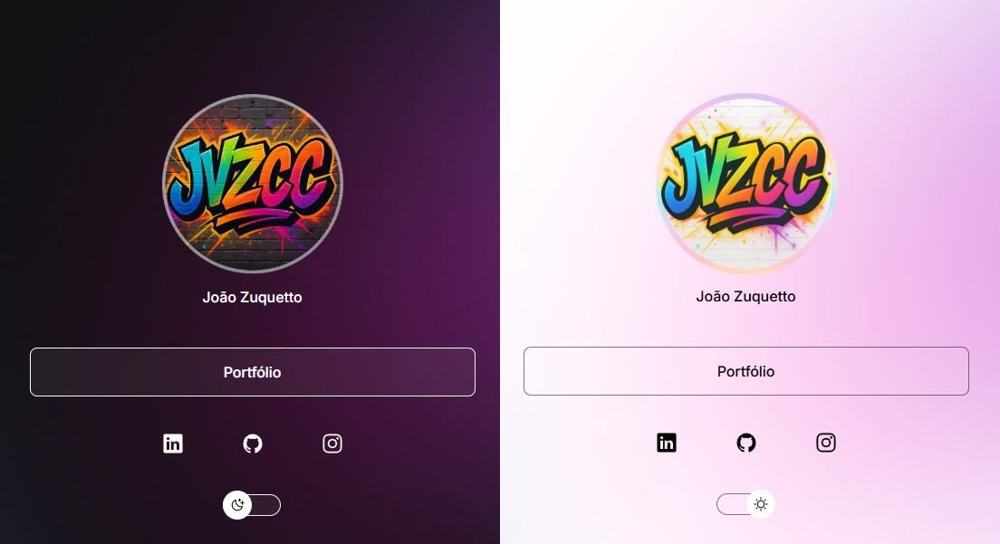

<h1 align="center">🌐 Basic Linktree</h1>

  Uma versão simples e funcional do Linktree, feita para compartilhar seus links favoritos.

  

## 📚 Sobre o projeto

Este projeto foi desenvolvido como parte do curso Discover da 
<a href="https://www.rocketseat.com.br" target="_blank"><strong>Rocketseat</strong></a>, 
com o objetivo de praticar conceitos fundamentais de HTML, CSS e JavaScript.

---

## 🚀 Funcionalidades

- Lista de links clicáveis  
- Modo dark/light  
- Responsivo a diversos dispositivos
---

## 💻 Conhecimento introdutório adquirido

- HTML  
- CSS  
- JavaScript  
- Git e GitHub  
- Figma  

---

## 📝 Licença

Este projeto está licenciado sob a **Licença MIT**.  

---
